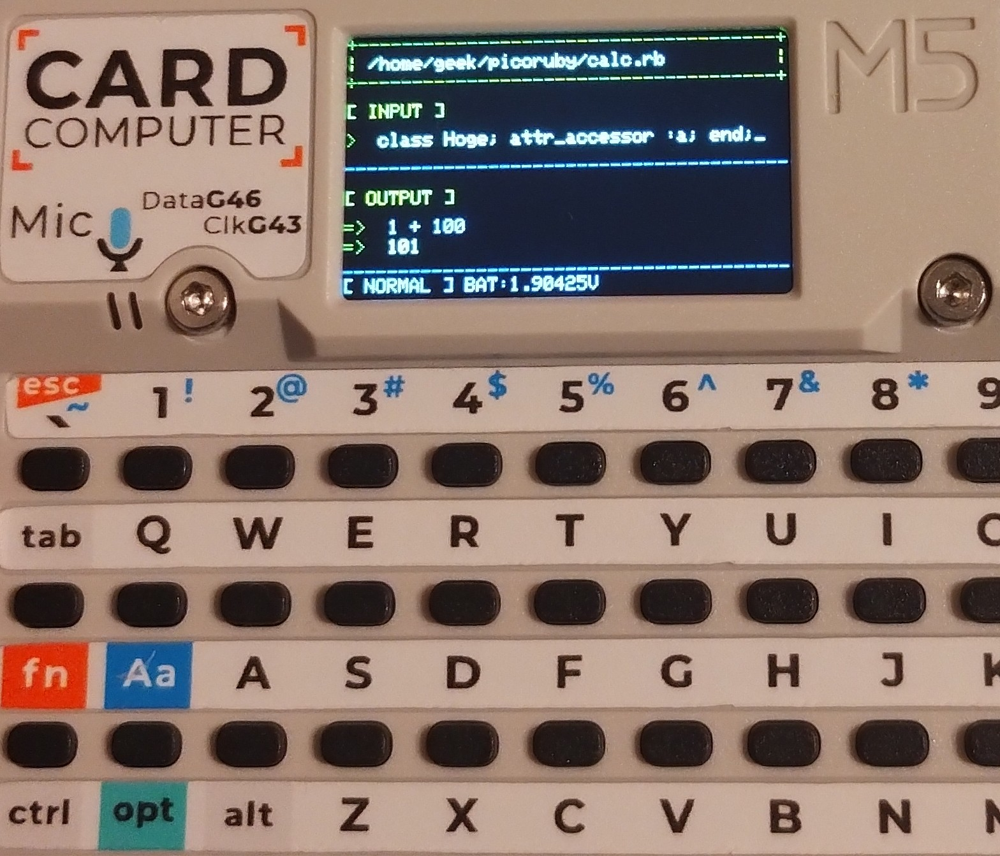

# 💎 PicoRuby Calculator ✨



🚀 **Ruby REPL in your pocket!** 🎒 Write and execute Ruby code **anywhere** with this M5Stack Cardputer v1.1-powered handheld device! ⚡ Features real-time code execution, syntax error detection, and battery monitoring - because why should Ruby be stuck on your desktop? 🖥️❌

> 📌 **Note:** This project is specifically designed for **M5Stack Cardputer v1.1** 🎮

---

## 🛠️ Setup

### 1️⃣ Update submodules
```bash
git submodule update --init --recursive
```

### 2️⃣ Update CMakeLists

📝 Edit `components/picoruby-esp32/CMakeLists.txt`:

**➕ Add to SRCS:**
```cmake
${COMPONENT_DIR}/../picoruby-m5unified/ports/esp32/m5unified_core.cpp
${COMPONENT_DIR}/../picoruby-m5unified/ports/esp32/m5gfx_color.cpp
${COMPONENT_DIR}/../picoruby-m5unified/ports/esp32/m5gfx_display.cpp
${COMPONENT_DIR}/../picoruby-m5unified/ports/esp32/m5gfx_draw.cpp
${COMPONENT_DIR}/../picoruby-m5unified/ports/esp32/m5gfx_fill.cpp
${COMPONENT_DIR}/../picoruby-m5unified/ports/esp32/m5gfx_image.cpp
${COMPONENT_DIR}/../picoruby-m5unified/ports/esp32/m5gfx_lowlevel.cpp
${COMPONENT_DIR}/../picoruby-m5unified/ports/esp32/m5gfx_text.cpp
${COMPONENT_DIR}/../picoruby-m5unified/ports/esp32/m5gfx_util.cpp
```

**➕ Add to INCLUDE_DIRS:**
```cmake
${COMPONENT_DIR}/../picoruby-m5unified/include
```

**➕ Add to PRIV_REQUIRES:**
```cmake
M5Unified
M5GFX
```

### 3️⃣ Update build configuration

📝 Edit `components/picoruby-esp32/picoruby/build_config/xtensa-esp.rb`:

```ruby
conf.gem File.expand_path('../../../picoruby-m5unified', __dir__)
```

### 4️⃣ Apply theme 🎨

Choose and apply a theme for your calculator:

```bash
# List available themes
make list-themes

# Apply your chosen theme (e.g., default or geek)
make apply-theme THEME=default
```

### 5️⃣ Build and flash 🔥

```bash
. $(YOUR_ESP_IDF_PATH)/export.sh
idf.py set-target esp32s3
idf.py build
idf.py flash
```

---

## ⚠️ Known Issues

🚧 **Work in Progress** - The following issues are currently being fixed:

- 🔄 **Resource Exhaustion**: After multiple executions, resources may become exhausted, causing the device to restart

Stay tuned for updates! 🛠️

